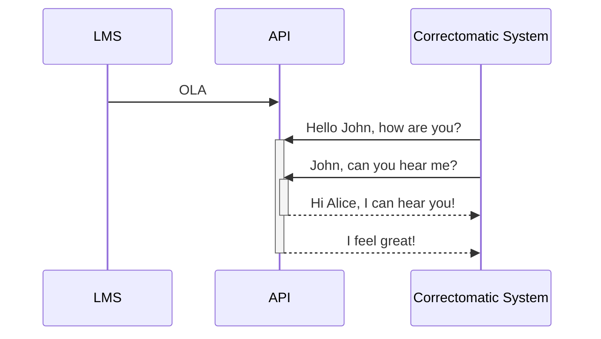

# Correctomatic

README for correctomatic

## What is Correctomatic?

TO-DO

The Correctomatic is a system for runing corrections

### How does it work

### API

TO-DO

- Endpoint for creating corrections
- Correctomatic response

### Container API

TO-DO

### LTI Integration

TO-DO

## Architecture

TO-DO

## Development

TO-DO

## Repositories

### Respositories for corrections

| Repository 	| Description 	|
|------------	|-------------  |
| [correction-test-java](https://github.com/correctomatic/correction-test-java) | Test for correcting Java exercises |
| [correction-test-chatgpt](https://github.com/correctomatic/correction-test-chatgpt) 	|  Test for correcting exercises using a LLM	|

### Repositories with source code

These are the repositories with the source code for the Correctomatic system. They are the main repositories for the project,
you will need to use them if you want to contribute to the project. If you only want to create an exercise, you won't need to use them.

| Repository 	| Description 	|
|------------	|-------------  |
| [correction-API](https://github.com/correctomatic/correction-API) | Server with the endpoint for launching corrections |
| [correction-runner](https://github.com/correctomatic/correction-runner)	| Main processes fof the corrections: launcher, completer and notifier 	|
| [correctomatic-app](https://github.com/correctomatic/correctomatic-app)	| LTI 1.3 app for integrating the correctometic with a LMS. **It's in early stages of development**. 	|

### Repositories with tools for development

You can use these repositories to help you develop the Correctomatic system. They are not necessary for creating an exercise.

| Repository 	| Description 	|
|------------	|-------------  |
| [correctomatic-server](https://github.com/correctomatic/correctomatic-server) | Docker compose for launching the full Correctomatic system in local |
| [correction-example-receiver](https://github.com/correctomatic/correction-example-receiver) | A simple example webhook to receive correction results and store them in files 	|
| [correction-test-1](https://github.com/correctomatic/correction-test-1)	| Docker image with a simple corrector for testing the workflow	|
| [moodle-development](https://github.com/correctomatic/moodle-development)	| Development environment for moodle, with debug, in case you need to develop the LTI app 	|

### Repositories for deployment

The repositories in this block are intented for deploying the Correctomatic system.

| Repository 	| Description 	|
|------------	|-------------  |
| [runner-image](https://github.com/correctomatic/runner-image) | Docker image with the runner processes. You can find it in [DockeHub](https://hub.docker.com/r/correctomatic/runner)  |
| [API-image](https://github.com/correctomatic/API-image) | Docker image with the correctomatic API. You can find it in [DockeHub](https://hub.docker.com/r/correctomatic/api)  |
| [ansible-vps](https://github.com/correctomatic/) | Ansible playbook for provisioning correctomatic in a single VPS  |

### Proofs of concept

The following repositories are early tests and proof of concepts, most of them are private and will probably be deleted in the future.

| Repository 	| Description 	|
|------------	|-------------  |
| [prueba-lti](https://github.com/correctomatic/prueba-lti) | LTI proof of concept |
| [pylti1.3-flask-example](https://github.com/correctomatic/pylti1.3-flask-example) | PyLTI1p3 Flask usage example 	|
| [java-demo-project](https://github.com/correctomatic/java-demo-project) | Demo Java project in vscode for tests |
| [pruebas-eslint](https://github.com/correctomatic/) | Test for creating custom ESLint rules for corrections 	|
