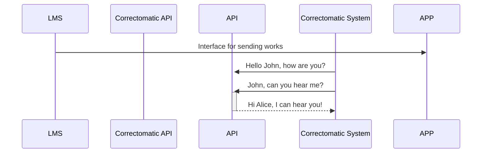
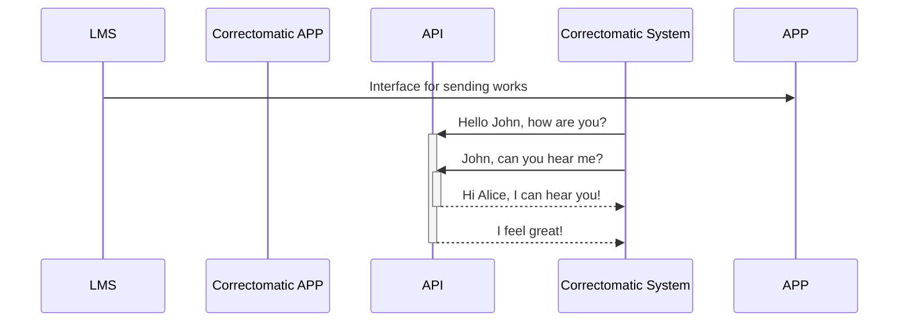
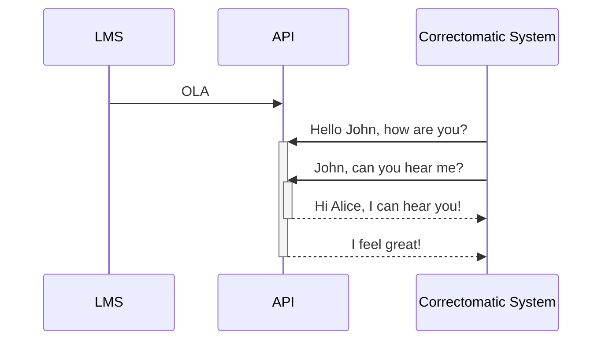

# Correctomatic

[Repositories list](#repositories)

## What is the Correctomatic?

The Correctomatic is a system designed to correct students' work automatically. It is primarily intended to correct technical
software exercises, but can also be used to correct other types of assignments.

It uses an API to send corrections and can be integrated with LMS systems using the LTI 1.3 standard.

To correct the exercises, it uses Docker containers with images that can be prepared for any kind of correction. Templates are prepared for some typical types of corrections such as testing with Jest, JUnit or Cypress.

### How to use it

#### Provisioning the system

The easiest way to deploy the system is using the [correctomatic-in-a-box](https://github.com/correctomatic/correctomatic-in-a-box). It will provision the full system in a single server using ansible in about 10 minutes. It
will also provision a Docker registry, so you can push your correction images to it and keep them private. If you need more fine tunning keep reading, but if you're starting, this is the best way to go.

For a more detailed provisioning, you must take in account that the Correctomatic has some components:
- A Redis server
- The API
- The starter
- The completer
- The notifier
- The LTI app
- A Docker server

The API, starter, completer and notifier communicate using a Redis server. The LTI app uses the API and it is an independent component. The Docker server is an standard one, used to run the correction images.

Those components are independent and can be deployed in different servers. You can also have duplicated "blocks" of them, they only need to share the same Redis and Docker servers. For example, you can have two starters, two completers and two notifiers in different machines, and they can work in parallel, each one using a different Docker server.

There are images for the API, the starter, the completer and the notifier in the [DockerHub](https://hub.docker.com/u/correctomatic). You can use them to deploy the system in a Kubernetes cluster, for example. You can also check the [correctomatic-in-a-box](https://github.com/correctomatic/correctomatic-in-a-box) repository and the images' repositories for more information about how to configure them.

#### Integration into a LMS using LTI 1.3

The Correctomatic system can be integrated into a LMS using the LTI 1.3 standard. The LMS sends the student's work to the Correctomatic system, which corrects it and sends the result back to the LMS.

There is more information about how to run and integrate the App in the [App's repository](https://github.com/correctomatic/correctomatic-app). It's still in development, but it's functional.

#### Using the API

The corrections can be sent to the system using the API. The API has an endpoint to send the corrections and will send the results as a webhook.

TO-DO

```mermaid
sequenceDiagram
    participant LMS
    participant Correctomatic API
    participant API
    participant Correctomatic System
    LMS->>APP: Interface for sending works
    Correctomatic System->>+API: Hello John, how are you?
    Correctomatic System->>+API: John, can you hear me?
    API-->>-Correctomatic System: Hi Alice, I can hear you!
```

### How does it work

TO-DO

```mermaid
sequenceDiagram
    participant LMS
    participant Correctomatic APP
    participant API
    participant Correctomatic System
    LMS->>APP: Interface for sending works
    Correctomatic System->>+API: Hello John, how are you?
    Correctomatic System->>+API: John, can you hear me?
    API-->>-Correctomatic System: Hi Alice, I can hear you!
    API-->>-Correctomatic System: I feel great!
```

### API

TO-DO

- Endpoint for creating corrections
- Correctomatic response

### Container API

TO-DO

### LTI Integration

TO-DO

## Architecture

TO-DO

```mermaid
sequenceDiagram
    LMS->>API: OLA
    Correctomatic System->>+API: Hello John, how are you?
    Correctomatic System->>+API: John, can you hear me?
    API-->>-Correctomatic System: Hi Alice, I can hear you!
    API-->>-Correctomatic System: I feel great!
```

## Development

TO-DO

## Repositories

### Respositories for corrections
These repositories serves as the base for creating exercises. When creating an exercise, it's useful to use one of these
repositories as a base: it will save you lots of time and effort.

| Repository 	| Description 	|
|------------	|-------------  |
| [correction-jest](https://github.com/correctomatic/correction-jest) | Corrects Javascript exercises using Jest |
| [correction-cypress](https://github.com/correctomatic/correction-cypress) | Corrects exercises using Cypres |
| [correction-test-java](https://github.com/correctomatic/correction-test-java) | Test for correcting Java exercises |
| [correction-test-chatgpt](https://github.com/correctomatic/correction-test-chatgpt) 	|  Test for correcting exercises using a LLM	|

### Repositories with source code

These are the repositories with the source code for the Correctomatic system. They are the main repositories for the project,
you will need to use them if you want to contribute to the project. If you only want to create an exercise, you won't need to use them.

| Repository 	| Description 	|
|------------	|-------------  |
| [correction-API](https://github.com/correctomatic/correction-API) | Server with the endpoint for launching corrections |
| [correction-runner](https://github.com/correctomatic/correction-runner)	| Main processes fof the corrections: launcher, completer and notifier 	|
| [correctomatic-app](https://github.com/correctomatic/correctomatic-app)	| LTI 1.3 app for integrating the correctometic with a LMS. **It's in early stages of development**. 	|

### Repositories with tools for development

You can use these repositories to help you develop the Correctomatic system. They are not necessary for creating an exercise.

| Repository 	| Description 	|
|------------	|-------------  |
| [correctomatic-server](https://github.com/correctomatic/correctomatic-server) | Docker compose for launching the full Correctomatic system in local |
| [correction-example-receiver](https://github.com/correctomatic/correction-example-receiver) | A simple example webhook to receive correction results and store them in files 	|
| [correction-test-1](https://github.com/correctomatic/correction-test-1)	| Docker image with a simple corrector for testing the workflow	|
| [moodle-development](https://github.com/correctomatic/moodle-development)	| Development environment for moodle, with debug, in case you need to develop the LTI app 	|

### Repositories for deployment

The repositories in this block are intented for deploying the Correctomatic system.

| Repository 	| Description 	|
|------------	|-------------  |
| [runner-image](https://github.com/correctomatic/runner-image) | Docker image with the runner processes. You can find it in [DockeHub](https://hub.docker.com/r/correctomatic/runner)  |
| [API-image](https://github.com/correctomatic/API-image) | Docker image with the correctomatic API. You can find it in [DockeHub](https://hub.docker.com/r/correctomatic/api)  |
| [correctomatic-in-a-box](https://github.com/correctomatic/correctomatic-in-a-box) | Ansible playbook for provisioning correctomatic in a single server.  |

### Proofs of concept

The following repositories are early tests and proof of concepts, most of them are private and will probably be deleted in the future.

| Repository 	| Description 	|
|------------	|-------------  |
| [prueba-lti](https://github.com/correctomatic/prueba-lti) | LTI proof of concept |
| [pylti1.3-flask-example](https://github.com/correctomatic/pylti1.3-flask-example) | PyLTI1p3 Flask usage example 	|
| [java-demo-project](https://github.com/correctomatic/java-demo-project) | Demo Java project in vscode for tests |
| [pruebas-eslint](https://github.com/correctomatic/) | Test for creating custom ESLint rules for corrections 	|
